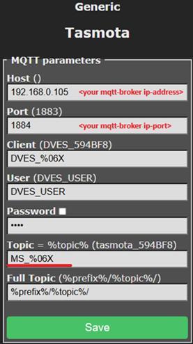

# ESP8266 Tasmota Moisture Sensor Firmware

This folder contains the setup and configuration guide for using an ESP8266-based soil moisture sensor running **Tasmota** firmware within the Plant Watering Controller system.

## Overview

This setup turns a low-cost ESP8266 board (e.g. Wemos D1 Mini) into a self-contained soil moisture sensor.  
It reads the analog input (A0), publishes the value via MQTT, and can enter **deep sleep** to save power.

---

## Installation Guide

### 1. Download and Flash Tasmota

**Note 1:** For flashing the wiring between D0 and RST needs to be interupted.  
**Note 2:** Your browser does need to support Web Serial, use Google Chrome or Microsoft Edge.

1. Go to [https://tasmota.github.io/install/](https://tasmota.github.io/install/).
2. Connect your ESP8266 board via USB.
3. Select **Tasmota Sensors** from your browser.
4. Configure your Wi-Fi Access right now and click on "Visit Device"-Option.
or  
5. Connect to the Wi-Fi access point created by the ESP8266 (SSID `tasmota-XXXX`).
6. Enter your Wi-Fi credentials and reconnect to your network.

**Note 3:** After flashing the wiring between D0 and RST needs to be reconnected.  

Additional Information: [https://tasmota.github.io/docs/Getting-Started/#initial-configuration](https://tasmota.github.io/docs/Getting-Started/#initial-configuration)

---

### 2. Initial Setup

1. Access the Tasmota web interface (just the ip-address of the connected device, e.g. <http://192.168.0.186>).  
   You can get it e.g. from your router in the list of connected devices.  
   If you configured the Wi-Fi Access right during flashing process you can directly click on the  
   "Visit Device"-Option.
2. Go to **Configuration → Module → Module Type: Generic (18)**. Then click on Save to restart the device.
3. Go to **Configuration → Module and now set the Module Parameters like on the screenshot.

#### Template & Pin Configuration

| Setting | Description |
|----------|--------------|
| Module Type | Generic (18) |
| A0 | Analog sensor input |
| Power1 | GPIO used to power the sensor (optional) |
| Others | Leave unconfigured |

  

  

---

### 3. Configure MQTT

Set your MQTT broker connection in **Configuration → Configure MQTT**:

| Setting | Example |
|----------|----------|
| Host | `192.168.1.105` |
| Port | `1883` |
| Topic | `MS_%06X` |

---

### 4. Load the Rules

Paste the rules from [`tasmota_rules.md`](./tasmota_rules.md) into the **Tasmota Console**, then enable them:

Enable rules:

~~~bash
Rule1 1

ruletimer1 3
~~~

The rule handle ADC reading, MQTT publishing, and optionally entering deep sleep mode.  
The <device_topic> is also used in the plant controller in Nodered, and as it should not be modified,  
mark the device with this <device_topic>.

---

### 5. MQTT Communication

The sensor periodically publishes its moisture readings via MQTT.  
You can manually set the deep sleep interval by publishing to:

~~~bash
cmnd/MS_594908/Mem3 0
~~~

| Value | Meaning |
|--------|----------|
| `0` | Stay awake (no sleep) |
| `>0` | Deep sleep time in seconds |

Example telemetric message: [`tele_format_example.json`](./tele_format_example.json)

~~~json
{
  "Time": "2025-10-06T15:29:58",
  "utctime": 1759760998,
  "adc": 268
}
~~~

---

Some mqtt commands i used during testing

~~~bash
mosquitto_pub -h 192.168.0.105 -t cmnd/MS_594908/mem3 -m <x>    # 0 No DeepSleep >0 DeepSleep in seconds

-r retained
-n delete retained message
mosquitto_pub -h 192.168.0.105 -t cmnd/MS_594908/mem3 -r -n 
~~~

---

## See Also

- [Node-RED integration](../../nodered/README.md)
- [InfluxDB example queries](../../influxdb/example_queries.md)
- [Hardware notes](../../hardware/README.md)
