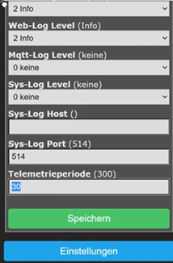

# ESP8266 Tasmota Moisture Sensor Firmware

This folder contains the setup and configuration guide for using an ESP8266-based soil moisture sensor running **Tasmota** firmware within the Plant Watering Controller system.

## Overview

This setup turns a low-cost ESP8266 board (e.g. Wemos D1 Mini) into a self-contained soil moisture sensor.  
It reads the analog input (A0), publishes the value via MQTT, and can enter **deep sleep** to save power.

---

## Installation Guide

### 1. Download and Flash Tasmota

1. Go to [https://tasmota.github.io/install/](https://tasmota.github.io/install/).
2. Connect your ESP8266 board via USB.
3. Select **Tasmota (Generic)** as firmware type.
4. Flash the firmware directly from the browser.

> **Tip:** For boards with analog sensors only, `tasmota-sensors.bin` is also a good choice.

---

### 2. Initial Setup

# ESP8266 Tasmota Moisture Sensor Firmware

This folder contains the setup and configuration guide for using an **ESP8266-based soil moisture sensor** running **Tasmota** firmware within the Plant Watering Controller system.

---

## 🌱 Overview

This setup turns a low-cost ESP8266 board (e.g. Wemos D1 Mini) into a self-contained **soil moisture sensor**.  
It reads the analog input (A0), publishes the value via **MQTT**, and can enter **deep sleep** to save power.

---

## ⚙️ Installation Guide

### 1. Download and Flash Tasmota

1. Go to [https://tasmota.github.io/install/](https://tasmota.github.io/install/).
2. Connect your ESP8266 board via USB.
3. Select **Tasmota (Generic)** as the firmware type.
4. Flash the firmware directly from your browser.

> 💡 **Tip:** For boards with analog sensors only, `tasmota-sensors.bin` is also a good choice.

---

### 2. Initial Setup

1. Connect to the Wi-Fi access point created by the ESP8266 (SSID `tasmota-XXXX`).
2. Enter your Wi-Fi credentials and reconnect to your network.
3. Access the Tasmota web interface — usually available at: <http://tasmota.local>
4. Go to **Configuration → Configure Module → Module Type: Generic (18)**.

#### Example Template & Pin Configuration

| Setting | Description |
|----------|--------------|
| Module Type | Generic (18) |
| A0 | Analog sensor input |
| Power1 | GPIO used to power the sensor (optional) |
| Others | Leave unconfigured |

  

---

### 3. Configure MQTT

Set your MQTT broker connection in **Configuration → Configure MQTT**:

| Setting | Example |
|----------|----------|
| Host | `192.168.1.100` |
| Port | `1883` |
| Client ID | `MS_594908` |
| Topic | `MS_594908` |
| FullTopic | `tele/%topic%/` |

---

### 4. Load the Rules

Paste the rules from [`tasmota_rules.md`](./tasmota_rules.md) into the **Tasmota Console**, then enable them:

Enable rules:

~~~bash
Rule1 1
~~~

The rule handle ADC reading, MQTT publishing, and optionally entering deep sleep mode.

---

### 5. MQTT Communication

The sensor periodically publishes its moisture readings via MQTT.  
You can manually set the deep sleep interval by publishing to:

~~~bash
cmnd/MS_594908/Mem3 0
~~~

| Value | Meaning |
|--------|----------|
| `0` | Stay awake (no sleep) |
| `>0` | Deep sleep time in seconds |

Example telemetric message: [`tele_format_example.json`](./tele_format_example.json)

~~~json
{
  "Time": "2025-10-06T15:29:58",
  "utctime": 1759760998,
  "adc": 268
}
~~~

---

## Additional Notes

- `TelePeriod` defines how often telemetry data is sent (default 30s).
- Rule timers manage when data is sent and when to enter deep sleep.
- Power is turned on (`Power1 1`) on boot to power the sensor directly from GPIO.
- The analog input (`A0`) is read and stored in `Var1`.

---

## Best Practices / Field Experience

- **Power consumption:** Add a hardware switch or MOSFET to disconnect the sensor between reads to avoid corrosion.
- **ADC calibration:** Calibrate ADC values in Node-RED or InfluxDB using a dry and fully wet reference.
- **Sleep optimization:** For battery setups, use DeepSleepTime between 300–900 seconds depending on power source.
- **Sensor type:** Capacitive sensors are recommended over resistive ones to reduce degradation.
- **Firmware update:** Keep Tasmota up to date for MQTT stability and bug fixes.

---

## See Also

- [Node-RED integration](../../nodered/README.md)
- [InfluxDB example queries](../../influxdb/example_queries.md)
- [Hardware notes](../../hardware/README.md)
